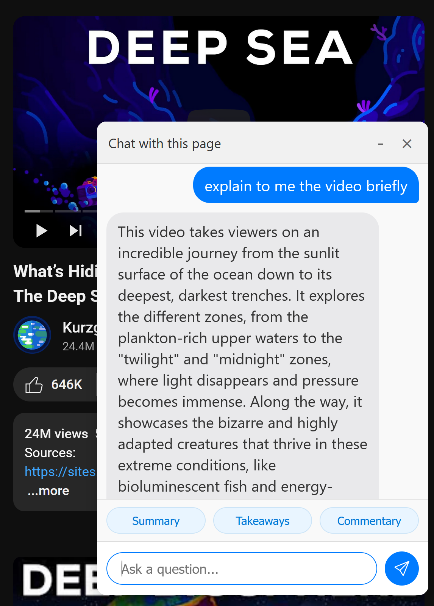
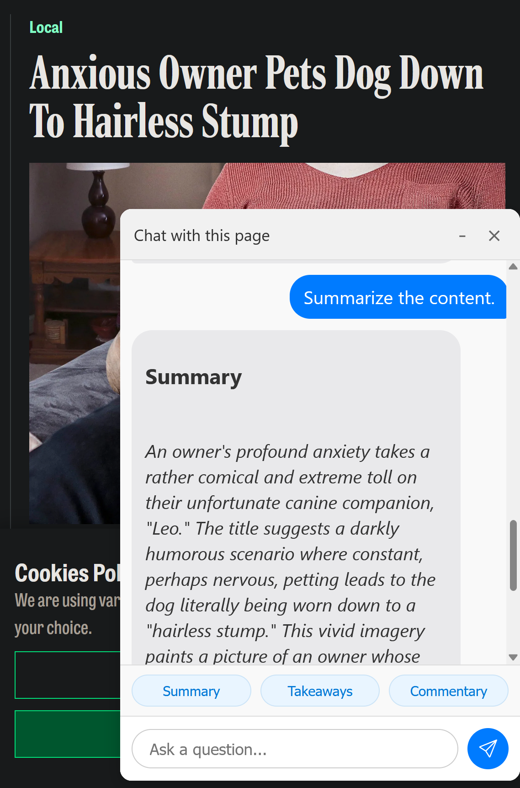

# CWW (Chat With Web)


CWW (Chat With Web) lets you chat with the currently opened tab in Firefox. It enables you to interact with articles and YouTube videos directly from your browser. However, chatting with non-article sites is not supported at this time. Additionally:
- Chatting with pages that require a sign-in is currently not supported.
- Private YouTube videos cannot be accessed for chat.

The default language of chat is English, but you can chat in any language as long as it is supported by Gemini.

The purpose of the app is to enhance your understanding of articles and YouTube videos in an educational context. It can:
- Summarize lengthy articles into clear and concise points.
- Extract key insights or arguments from opinion pieces.
- Provide detailed explanations for complex topics covered in YouTube videos.
- Help you grasp the intention and perspective of the writer or creator.

The app integrates with Google Gemini, so you will need to obtain your Gemini API key by visiting [Google AI Studio](https://aistudio.google.com/app/apikey). Gemini offers **250 free requests per day** (with a maximum of 10 requests per minute), allowing you to chat with a large number of pages daily.

---

## Requirements

To use CWW, you need to:
1. Run the **cww-backend**.
2. Install the **Firefox Addon**.

---

## Installation Guide


### 1. Install cww-backend

#### Download the Correct Build for Your Platform

Pre-built binaries and service files for all major platforms are available for download:

**Download all builds:** [https://k00.fr/7g2odl9j](https://k00.fr/7g2odl9j)

Extract the archive that matches your operating system and CPU architecture:

| Archive Name         | Platform                |
|---------------------|-------------------------|
| windows-amd64.zip   | Windows 64-bit (x86_64) |
| windows-386.zip     | Windows 32-bit (x86)    |
| linux-amd64.zip     | Linux 64-bit (x86_64)   |
| linux-arm64.zip     | Linux 64-bit (ARM)      |
| darwin-amd64.zip    | macOS 64-bit (Intel)    |
| darwin-arm64.zip    | macOS 64-bit (Apple Silicon) |


#### Virus Scan Results

To ensure the safety of the binaries, you can review the VirusTotal scan results for each build:

| Platform                | VirusTotal Link                                                                 |
|-------------------------|-------------------------------------------------------------------------------|
| Windows 64-bit (x86_64) | [VirusTotal Scan](https://www.virustotal.com/gui/file/7f5126555b3ed424cb555bc768d1f48dfb02217d5afb43ec3ecb1906a20fcb3b/details) |
| Windows 32-bit (x86)    | [VirusTotal Scan](https://www.virustotal.com/gui/file/de6b3ce308a1f31f3ff1ea0c80835b2d53f4a1334c52beea8a94b08b4a530f14/detection) |
| Linux 64-bit (x86_64)   | [VirusTotal Scan](https://www.virustotal.com/gui/file/d52637e7526f756ede3020018fa861e72bf5f7b1b08c2d25c2800f4fe9925fd5/details) |
| Linux 64-bit (ARM)      | [VirusTotal Scan](https://www.virustotal.com/gui/file/b831c0f2def34e5139467d63e0e02182ec2c80089b6461874076f2e39f4807e6/details) |
| macOS 64-bit (Intel)    | [VirusTotal Scan](https://www.virustotal.com/gui/file/479f0b42a8483a531c54ad973d8ea4f28395f1dccb2a692f5444044cf4e884de?nocache=1) |
| macOS 64-bit (Apple Silicon) | [VirusTotal Scan](https://www.virustotal.com/gui/file/235d5584be13028542d118261976b475839c7282b97b74f6fa8d72c24ae975cb/details) |

> **Note:** The Windows 32-bit (x86) build shows 1/72 detections on VirusTotal (`W32.Malware.gen`). This is a known false positive that sometimes occurs with Go-compiled binaries, especially for 32-bit Windows targets. The binary is safe and clean; you can verify this by checking the scan details and seeing that all major antivirus engines report it as clean.

After downloading, extract the contents to a folder of your choice. Then follow the instructions below for your platform.


#### Install and Manage as a Service (All Platforms)

On **Windows, Linux, and macOS**, you can install, start, stop, and uninstall the backend as a service using the same commands. The service will be set to start automatically on boot and will survive restarts.

1. Extract the pre-built release for your platform to a folder (e.g., `C:\cww-backend` on Windows, `/opt/cww-backend` or `~/cww-backend` on Linux/macOS).
2. Open a terminal (**PowerShell as Administrator** on Windows, or a terminal with appropriate permissions on Linux/macOS) in that folder.
3. Run the following command to install the service:
   ```sh
   ./cww-backend install
   ```
   - To manage the service:
     ```sh
     ./cww-backend start      # Start the service
     ./cww-backend stop       # Stop the service
     ./cww-backend uninstall  # Uninstall the service
     ```
   - On Windows, use `./cww-backend.exe ...` if running from PowerShell.
   - Set environment variables (if required) before installing or starting the service (see "Environment Variables" below).

#### Using Docker (Works on Any OS)

1. Make sure Docker is installed and running.

> **Note:** The Docker method works on both x86-based (most Windows/Linux PCs, Intel-based Macs) and ARM64-based systems (Apple Silicon Macs, Raspberry Pi, etc.) as long as Docker is installed. Be sure to use the correct image tag for your system: `asimijaz/cww-backend:latest` for x86, and `asimijaz/cww-backend:arm64` for ARM64.

2. Pull the appropriate image for your system:
   - For x86-based systems (most Windows/Linux PCs, Intel Macs):
     ```powershell
     docker pull asimijaz/cww-backend:latest
     ```
   - For ARM64-based systems (Apple Silicon Macs, Raspberry Pi, etc.):
     ```powershell
     docker pull asimijaz/cww-backend:arm64
     ```

3. Run the container as a daemon (background) and persist across Windows or Docker restarts:
   - For x86-based systems:
     ```powershell
     docker run -d --restart unless-stopped -p 54321:54321 asimijaz/cww-backend:latest
     ```
   - For ARM64-based systems:
     ```powershell
     docker run -d --restart unless-stopped -p 54321:54321 asimijaz/cww-backend:arm64
     ```
   - This exposes port **54321** on your host. You can change the left side of `-p` if you want to use a different external port.
   - The container will automatically restart if Docker or Windows restarts.

4. Set environment variables as needed (applies to all OSes):
   - See the [Environment Variables for CWW Backend](#environment-variables-for-cww-backend) section for available variables and their defaults.
   - **Windows:** Set environment variables in the System Properties > Environment Variables dialog before installing or starting the service. Restart the service after making changes.
   - **Linux (systemd):** Set environment variables in the `.service` file using `Environment=` lines, or use a systemd drop-in override. Reload and restart the service after changes.
   - **macOS (launchd):** Set environment variables in the `.plist` file under the `EnvironmentVariables` section. Reload and restart the service after changes.
   - **Docker:** Use the `-e` flag to set environment variables when running the container:
     ```sh
     docker run -d --restart unless-stopped \
       -e CWW_PORT=54321 -e CWW_SESSION_TTL=3600 -e CWW_CLEANUP_INTERVAL=300 \
       -e CWW_USE_YT_PROXY=true -e CWW_WEBSHARE_USER=youruser -e CWW_WEBSHARE_PASS=yourpass \
       -p 54321:54321 asimijaz/cww-backend:latest
     ```

---

### 2. Install Firefox Extension

Download the Firefox signed addon from [this link](https://k00.fr/rhi3whcv) and follow the steps below:

1. Download the `.xpi` file to your computer.
2. Open Firefox and either:
   - Drag and drop the `.xpi` file into the Firefox window.
   - Right-click the `.xpi` file and select "Open with Firefox".
3. Follow the prompts to install the addon.

---

## Setting Up the Gemini API Key and Service URL

1. Open Firefox and navigate to `about:addons`.
2. Locate the CWW extension and click on the three dots next to it.
3. Select `Options` from the dropdown menu.
4. Set the **Service URL** to `http://localhost:54321` (if running the backend locally on Windows).
5. Enter your **Gemini API Key** obtained from [Google AI Studio](https://aistudio.google.com/app/apikey).
6. Click `Save Settings` to apply the changes.

---

## Environment Variables for CWW Backend

The following environment variables can be set to customize the backend behavior:

| Variable                | Default      | Description                                                      |
|-------------------------|-------------|------------------------------------------------------------------|
| CWW_PORT                | 54321       | Port for backend server                                          |
| CWW_SESSION_TTL         | 3600        | Session time-to-live in seconds (default: 1 hour)                |
| CWW_CLEANUP_INTERVAL    | 300         | Session cleanup interval in seconds (default: 5 minutes)         |
| **(Docker only)**       |             | The following variables are only available in Docker (Python backend), not in Windows/Linux/macOS services (Go backend): |
| CWW_USE_YT_PROXY        | unset/false | Set to `true` to use a proxy for YouTube video chat              |
| CWW_WEBSHARE_USER       | unset       | Webshare proxy username (required if using proxy)                |
| CWW_WEBSHARE_PASS       | unset       | Webshare proxy password (required if using proxy)                |

---
## Backend Network/Proxy Notes

- The backend is intended to be run at your home IP address.
- If you are using a VPN or a data center IP, you must bypass the backend for chat with YouTube videos to work, or enable the proxy option.
- Currently, only the Webshare residential proxy is supported. This is a paid service; you must purchase their residential proxy package to use it. Visit [Webshare.io](https://www.webshare.io/) for more details.
---

To check if the backend is running successfully, open your browser and go to:

    http://localhost:54321/about

This confirms the backend is up and provides version and copyright information.

---

## Using CWW to Chat with Pages

To chat with any supported page, click the **CWW addon icon** in Firefox. This will open the chatbox, allowing you to interact with articles or YouTube videos directly.


---

CWW current version is not open source, but the intention is to make future versions open source. A key future goal is to eliminate the need for a backend, making the app more streamlined and accessible.

---

Enjoy chatting with your web pages using CWW!
